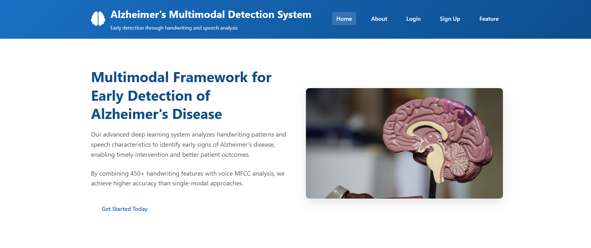

# Alzheimer's Disease Detection

A multimodal machine learning application for Alzheimer's disease analysis using handwriting-derived features and speech/audio signals.

## Application Preview



## Overview

This project explores complementary machine learning and deep learning approaches for Alzheimer's disease detection using two input modalities:

- Handwriting-derived features using a Random Forest classifier
- Speech/audio signals using a deep learning model with MFCC feature extraction

The project includes a Flask-based web application for user authentication, prediction, and result display.

## Key Features

- Handwriting/tabular feature-based prediction
- Speech/audio-based prediction
- Random Forest classification for handwriting-derived features
- Deep learning model for speech analysis
- MFCC feature extraction from audio
- Prediction probability and confidence display
- Flask web interface
- SQLite-based user authentication
- Saved model and preprocessing artifacts

## Model Performance

The project includes recorded evaluation metrics for the individual models and complementary multimodal framework:

| Model / Modality | Accuracy |
|---|---:|
| Handwriting / Random Forest | 90.57% |
| Speech / CNN | 98.00% |
| Complementary Multimodal Framework | 94.20% |

Additional evaluation metrics for the handwriting model include 92% sensitivity, 89.29% specificity, and 0.91 AUC.

## Tech Stack

- Python
- Pandas
- NumPy
- Scikit-learn
- TensorFlow / Keras
- Librosa
- Flask
- SQLite
- Joblib
- Jupyter Notebook

## Project Structure

```text
alzheimers-detection/
├── static/
├── templates/
├── app.py
├── alzheimers_random_forest_pipeline.joblib
├── alzheimers_speech_model.h5
├── feature_names.joblib
├── metrics.json
├── plots.py
├── requirements.txt
├── scaler.pkl
└── users.db
