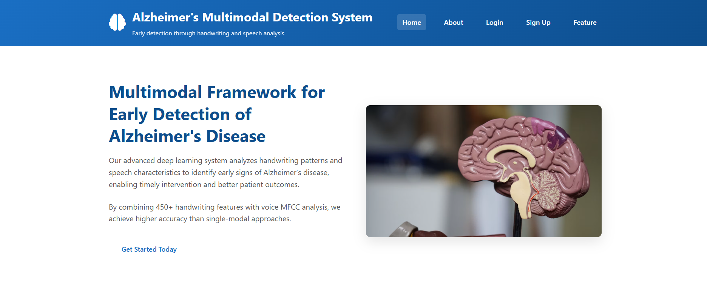

# Alzheimer's Disease Detection

A multimodal machine learning application exploring Alzheimer's disease detection using handwriting-derived features and speech/audio signals.

## Application Preview



## Overview

This project explores complementary machine learning and deep learning approaches for Alzheimer's disease detection using two input modalities:

- **Handwriting-derived features** using a Random Forest classifier
- **Speech/audio signals** using a deep learning model with MFCC feature extraction

The project includes a Flask-based web application that provides user authentication, prediction workflows, and result visualization.

## Key Features

- Handwriting-derived/tabular feature prediction
- Speech/audio-based prediction
- Random Forest classification for handwriting-derived features
- Deep learning model for speech analysis
- MFCC feature extraction using Librosa
- Prediction probability and confidence display
- Flask-based web interface
- SQLite-based local user authentication
- Saved model and preprocessing artifacts

## Model Performance

The repository contains recorded evaluation metrics for the individual models and the complementary multimodal framework.

| Model / Modality | Accuracy |
| --- | ---: |
| Handwriting / Random Forest | 90.57% |
| Speech / CNN | 98.00% |
| Complementary Multimodal Framework | 94.20% |

Additional evaluation metrics for the handwriting model:

- Sensitivity: **92.00%**
- Specificity: **89.29%**
- AUC: **0.91**

These values are reported from the project's evaluation artifacts and should be interpreted in the context of the underlying datasets and evaluation methodology.

## Tech Stack

- Python
- Pandas
- NumPy
- Scikit-learn
- TensorFlow / Keras
- Librosa
- Flask
- SQLite
- Joblib
- Jupyter Notebook

## Project Structure

```text
alzheimers-detection/
├── static/
├── templates/
├── app.py
├── alzheimers-app.png
├── alzheimers_random_forest_pipeline.joblib
├── alzheimers_speech_model.h5
├── feature_names.joblib
├── metrics.json
├── plots.py
├── Procfile
├── requirements.txt
└── scaler.pkl
